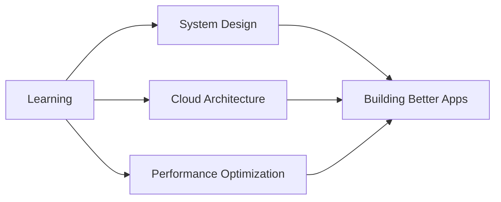

<div align="center">

```ascii
╔═══════════════════════════════════════════════════════════════╗
║                                                               ║
║   █████╗ ██╗     ██╗      █████╗ ███╗   ██╗                 ║
║  ██╔══██╗██║     ██║     ██╔══██╗████╗  ██║                 ║
║  ███████║██║     ██║     ███████║██╔██╗ ██║                 ║
║  ██╔══██║██║     ██║     ██╔══██║██║╚██╗██║                 ║
║  ██║  ██║███████╗███████╗██║  ██║██║ ╚████║                 ║
║  ╚═╝  ╚═╝╚══════╝╚══════╝╚═╝  ╚═╝╚═╝  ╚═══╝                 ║
║                                                               ║
║              Full-Stack Architect & Code Craftsman            ║
║                                                               ║
╚═══════════════════════════════════════════════════════════════╝
```


[](https://allanjustine.github.io/Portfolio)
[](https://github.com/allanjustine)
[](https://ph.linkedin.com/in/allan-justine-me)


</div>

---

## 🚀 About Me

```typescript
const allan = {
    location: "Philippines 🇵🇭",
    company: "SMCT Group of Companies",
    role: "Full-Stack Developer",
    code: ["PHP", "JavaScript", "TypeScript", "Java", "Dart"],
    architecture: ["MVC", "Microservices", "Event-Driven", "SPA"],
    currentFocus: "Building scalable enterprise applications",
    funFact: "I debug with console.log() and I'm not ashamed 😎"
};
```

## 💼 Tech Arsenal

<details open>
<summary><b>🎯 Core Stack</b></summary>
<br>

**Backend Mastery**
```
Laravel  ████████████████████░  95%
NestJS   ███████████████░░░░░  75%
Node.js  ██████████████████░░  90%
```

**Frontend Wizardry**
```
React       ████████████████████░  95%
Next.js     ██████████████████░░░  85%
Vue.js      ███████████████░░░░░  75%
TypeScript  ████████████████████░  95%
```

**Mobile Development**
```
React Native  ████████████████░░░░  80%
Flutter       ██████████████░░░░░░  70%
Android       ███████████████░░░░░  75%
```

</details>

<details>
<summary><b>🛠️ Tools & Technologies</b></summary>
<br>

| Category | Technologies |
|----------|-------------|
| **Frameworks** |      |
| **Styling** |    |
| **Database** |     |
| **DevOps** |    |
| **Tools** |    |
| **Extras** |     |

</details>

## 📊 GitHub Analytics

<div align="center">
  
  
</div>

<div align="center">
  
</div>

<div align="center">
  
</div>

## 🎯 Current Focus



- 🔭 Building enterprise-grade applications with Laravel & React
- 🌱 Exploring microservices architecture and cloud-native solutions
- 👯 Open to collaborate on innovative open-source projects
- 💡 Passionate about clean code, design patterns, and best practices
- ⚡ Fun fact: **Master in Eating, Sleeping, and Debugging** 🍕💤🐛

## 📫 Let's Connect

<div align="center">

[](mailto:labya31@gmail.com)
[](https://www.facebook.com/1down)
[](https://ph.linkedin.com/in/allan-justine-me)
[](https://allanjustine.github.io/Portfolio)

</div>

---

<div align="center">

### 💭 Dev Quote of the Day


### 🎵 Coding Soundtrack
*Currently vibing to: Lo-fi beats while shipping features* 🎧

**⭐ From [allanjustine](https://github.com/allanjustine) | Building the web, one commit at a time**


</div>
